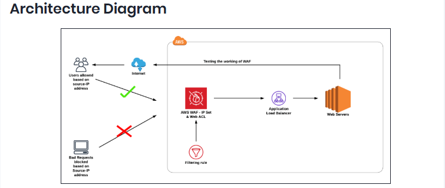
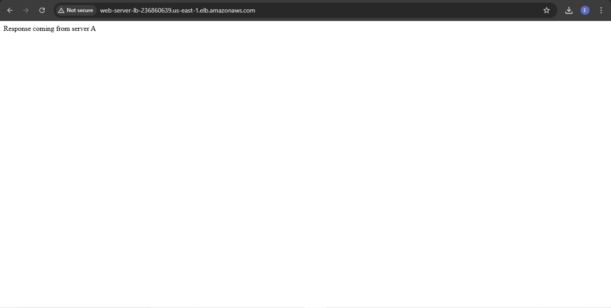
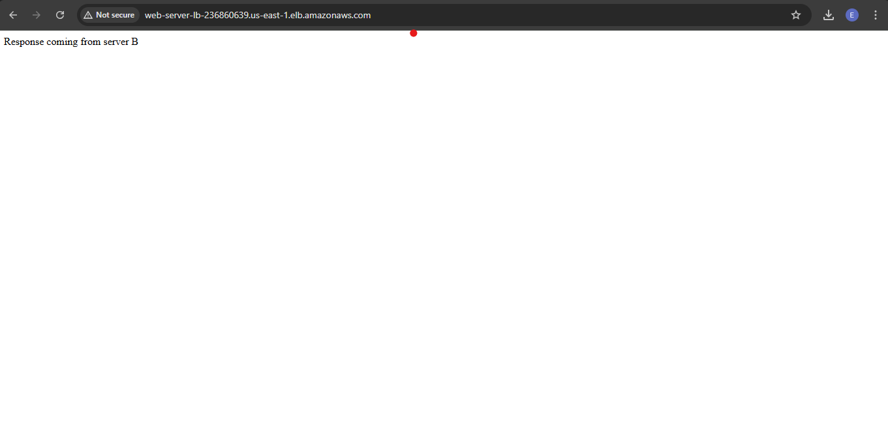
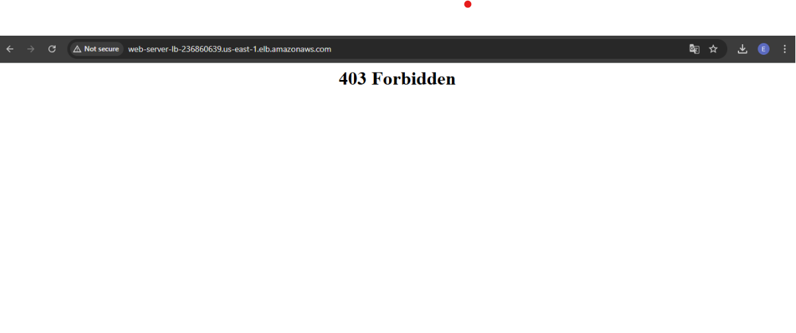

# AWS WAF — IP-Based Web Traffic Filtering for Load-Balanced Applications


## Overview

This project demonstrates the implementation of a **Web Application Firewall (WAF)** to protect a highly available, load-balanced web application running on AWS. The solution uses **AWS WAF IP Sets** and **Web ACLs** to enforce IP-based access control at the edge — blocking malicious or unauthorized traffic before it reaches the application tier.

This is a foundational security pattern used in production environments to protect public-facing applications from abuse, bot traffic, and targeted attacks.

---

## Problem Statement

Public-facing web applications are constantly exposed to threats including unauthorized access from known malicious IPs, automated scanners, and targeted attacks. Relying solely on security groups provides network-level protection but lacks the application-layer visibility and flexibility needed for dynamic threat response.

**The goal:** Implement a scalable, rule-driven filtering layer that can block specific IP ranges at the application layer without modifying infrastructure or taking servers offline.

---

## Architecture

<h2>Architecture Diagram</h2>

<p align="center">
  
</p>

**Traffic flow:**
1. Inbound requests hit **AWS WAF** before reaching the load balancer
2. WAF evaluates each request against the **Web ACL** rule set
3. Requests matching the blocked IP Set receive a `403 Forbidden` response
4. Permitted traffic is forwarded to the **Application Load Balancer**
5. The ALB distributes load across two EC2 web servers in the target group

---

## AWS Services Used

| Service | Role |
|---|---|
| **AWS WAF** | Application-layer firewall — IP Set and Web ACL management |
| **Application Load Balancer (ALB)** | HTTP traffic distribution across EC2 targets |
| **Amazon EC2** | Web server compute (Apache HTTPD on Amazon Linux 2023) |
| **Security Groups** | Network-level access control for ALB and EC2 instances |
| **IAM** | Console access and permissions management |

---

## Implementation

### Phase 1 — Network & Security Group Configuration

Created two security groups with the principle of least privilege:

**LoadBalancer-SG**
- Inbound: HTTP (port 80) from `0.0.0.0/0` — allows public internet traffic
- Purpose: Controls traffic entering the ALB

**webserver-SG**
- Inbound HTTP: allowed only from `LoadBalancer-SG` (not from the internet directly)
- Inbound SSH: allowed from anywhere (for administration)
- Purpose: Ensures web servers are only reachable through the load balancer

### Phase 2 — Web Server Provisioning

Launched two EC2 instances (`webserver-A`, `webserver-B`) running Apache HTTPD. Both servers were bootstrapped at launch using EC2 user data scripts (see [`scripts/`](./scripts/)).

Each server serves a unique response page, making it easy to verify load balancing is functioning correctly:
- Server A returns: `Response coming from server A`

<h2>Web Sever A Response Screenshot</h2>

<p align="center">
  
</p>

- Server B returns: `Response coming from server B`

<h2>Web Sever B Response Screenshot</h2>

<p align="center">
  
</p>
Both instances were registered to the ALB target group (`web-server-TG`) with HTTP health checks against `/index.html`.

### Phase 3 — Application Load Balancer Setup

Configured an internet-facing ALB (`Web-server-LB`) with:
- **Listener:** HTTP on port 80
- **Target group:** `web-server-TG` (both EC2 instances)
- **Health check path:** `/index.html`
- **Availability Zones:** All available AZs for fault tolerance

Verified the ALB was distributing traffic between both servers by refreshing the DNS endpoint and confirming alternating responses.

### Phase 4 — WAF IP Set Creation

Created a WAF **IP Set** (`MyIPset`) targeting a specific IPv4 CIDR range (`x.x.x.x/32`). The `/32` notation targets a single host IP, providing surgical precision in blocking.

> **Design note:** IP Sets are reusable across multiple Web ACLs, making this approach scalable for organizations managing shared block lists.

### Phase 5 — Web ACL and Rule Configuration

Created a **Web ACL** (`MywebACL`) and associated it with the ALB:

| Setting | Value |
|---|---|
| Resource type | Regional (ALB) |
| Region | US East (N. Virginia) |
| Rule type | IP Set |
| IP Set | MyIPset |
| Match condition | Source IP address |
| Action | Block |

The default action for unmatched traffic was set to **Allow**, meaning only explicitly listed IPs are blocked — a deny-list model.

### Phase 6 — Validation

After WAF propagation (~1-2 minutes), attempts to access the ALB DNS from the blocked IP returned:

```
403 Forbidden
```

<h2>WAF IPset Blocking Screenshot</h2>

<p align="center">
  
</p>

Removing the IP from the IP Set restored access within minutes — demonstrating how WAF enables **rapid incident response** without any infrastructure changes.

---

## Key Security Concepts Demonstrated

**Defense in depth** — Multiple layers of control: Security Groups (network layer) + WAF (application layer).

**Deny-list filtering** — Default-allow posture with explicit block rules, suitable for targeted threat response.

**Decoupled firewall rules** — WAF rules are managed independently of the ALB and EC2 instances, allowing security teams to update rules without touching application infrastructure.

**Zero-downtime response** — Blocking or unblocking IPs takes effect within minutes with no server restarts or deployments required.

---

## Project Structure

```
aws-waf-web-traffic-filtering/
├── README.md
├── scripts/
│   ├── webserver-a-userdata.sh       # EC2 bootstrap script for Server A
│   ├── webserver-b-userdata.sh       # EC2 bootstrap script for Server B
│   └── remove-ip-from-waf.md         # Steps to unblock an IP via CLI
└── docs/
    ├── security-group-config.md      # Detailed SG configuration reference
    └── waf-rule-reference.md         # Web ACL and IP Set configuration notes
```

---

## How to Reproduce

### Prerequisites
- AWS account with permissions for EC2, ALB, and WAF
- AWS CLI configured (optional — console steps documented)
- A public IP address to test blocking (check via [whatismyip.com](https://www.whatismyip.com))

### Steps

1. **Create security groups** — follow [`docs/security-group-config.md`](./docs/security-group-config.md)
2. **Launch EC2 instances** — use the user data scripts in [`scripts/`](./scripts/)
3. **Create ALB and target group** — register both instances, verify health checks pass
4. **Create WAF IP Set** — add the target IP in CIDR notation (`x.x.x.x/32`)
5. **Create Web ACL** — associate with the ALB, add IP Set rule with Block action
6. **Test** — access the ALB DNS from the blocked IP and confirm `403 Forbidden`
7. **Unblock** — delete the IP from the IP Set and confirm access is restored

---

## Outcomes & Learnings

- Gained hands-on experience implementing **AWS WAF** as an application-layer security control
- Understood the relationship between **IP Sets**, **Web ACLs**, and **associated AWS resources**
- Practiced the principle of **least privilege** in security group design (web servers not directly internet-accessible)
- Observed how WAF operates at **Layer 7** and returns HTTP-level responses (`403`) rather than dropping packets silently
- Understood trade-offs between **deny-list** (block specific IPs) vs. **allow-list** (block all except known IPs) WAF strategies

---

## References

- [AWS WAF Documentation](https://docs.aws.amazon.com/waf/latest/developerguide/)
- [Application Load Balancer Documentation](https://docs.aws.amazon.com/elasticloadbalancing/latest/application/)
- [AWS Security Best Practices](https://docs.aws.amazon.com/security/)

---

*Part of my AWS Cloud Engineering Portfolio — see other projects [here]((https://github.com/emmanuelessien-dev/cloud-portfolio))*
